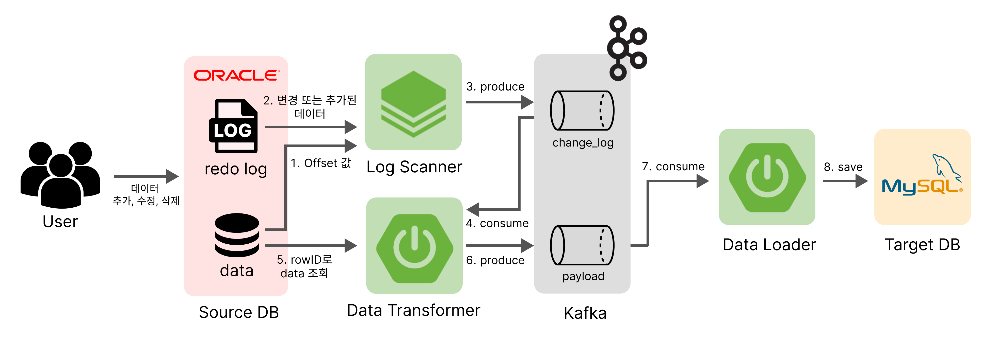
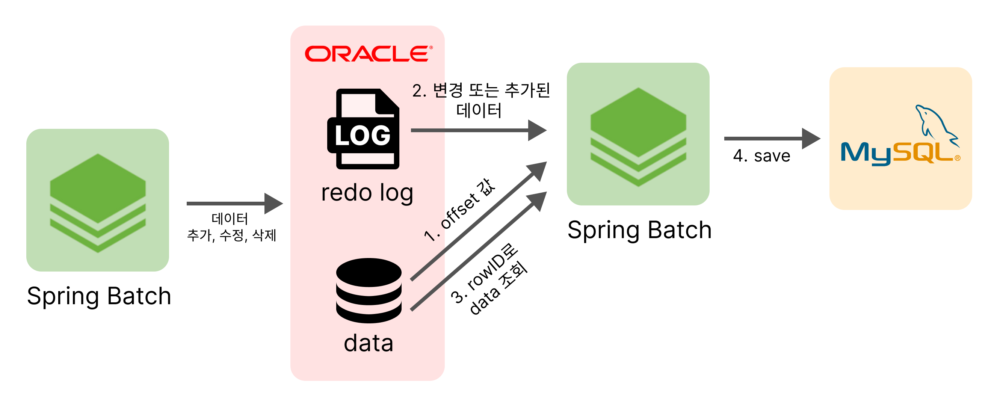
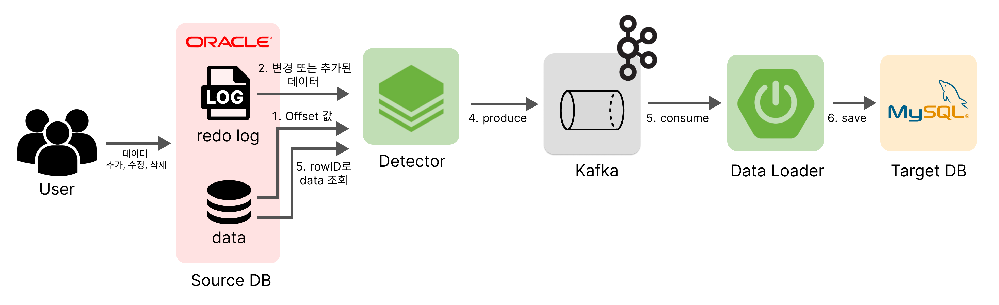

 

[//]: # ()
<!--  

 -->
 

## 팀원 소개

[//]: # (> **[한화시스템 BEYOND SW캠프 6기] Final Project**)

> **딥담화 DeepDamHwa** 
> 개발 기술스택을 주제로 매주 리뷰를 통해, 기술을 딥하게 학습하는 스터디 입니다.  
이 스터디는 실습을 통해 실무에서 적용할 수 있는 경험을 쌓는 것을 목표로 합니다. 
<table align="center">
 <tr>
    <td align="center"><a href="https://github.com/SihyunSeo"></td>
    <td align="center"><a href="https://github.com/kangkings"></td>
    <td align="center"><a href="https://github.com/706com"></td>
    <td align="center"><a href="https://github.com/jimnyy"></td>
    <td align="center"><a href="https://github.com/shinebyul"></td>
  </tr>
  <tr>
    <td align="center"><a href="https://github.com/SihyunSeo"><b>서시현</b></td>
    <td align="center"><a href="https://github.com/kangkings"><b>강태성</b></td>
    <td align="center"><a href="https://github.com/706com"><b>곽동현</b></td>
    <td align="center"><a href="https://github.com/jimnyy"><b>도지민</b></td>
    <td align="center"><a href="https://github.com/shinebyul"><b>한별</b></td>
  </tr>
  </table>
 

### 목차
- [기술 스택](#-기술-스택)
- [CDC 프로젝트 소개](#%EF%B8%8E%EF%B8%8E-cdc-project-소개)
- [프로젝트 설계](#-프로젝트-설계)
- [시스템 개선 과정](#-시스템-개선-과정)
- [문제 해결 사례](#-문제-해결-사례)
    

## 🔗 기술 스택
#### &nbsp;　[ Backend ]
&nbsp;&nbsp;&nbsp;&nbsp; 

#### &nbsp;　[ DB ]
&nbsp;&nbsp;&nbsp;</a>

#### &nbsp;　[ SERVER ]
&nbsp;&nbsp;&nbsp;

[//]: # (#### &nbsp;　[ Communication ])

[//]: # (&nbsp;&nbsp;&nbsp;&nbsp;)

[//]: # ()

[//]: # ()

[//]: # ()

[//]: # ()

[//]: # (   )

[//]: # (## 📚 Enadu 사이트 바로가기)

[//]: # (### [Enadu website]&#40;https://enadu.o-r.kr&#41;</a>)
  
## ︎︎🔗 CDC Project 소개

[//]: # ()

### 프로젝트 배경
딥담화 기술 리뷰에서 다뤘던 주제 **Data Migration (Oracle to MySQL)** 
초기에는 대량 데이터를 옮기는 가장 일반적인 방법인 "덤프-로드 방식"을 활용하여 마이그레이션을 진행했다. 
이 방식은 OracleDB 데이터를 한 번에 덤프한 후 MySQL로 로드하는 단순한 과정으로, 구현이 비교적 쉬운 장점이 있다.

그러나 실제로 마이그레이션을 수행하는 과정에서 다음과 같은 **문제점**을 발견하였다.

>**1. 서버 다운타임 발생:**
>
>- 대량의 데이터를 덤프하고 로드하는 동안 데이터베이스를 중단해야 했기 때문에 서비스의 연속성이 중단되었다.

>**2. 실시간 데이터 동기화 부족:**
>
>- 마이그레이션이 진행되는 동안 새로 삽입되거나 수정된 데이터가 누락될 가능성이 있었다.

>**3. 데이터 일관성 문제:**
>
>- 덤프 시점과 로드 완료 시점 간의 시간차로 인해 데이터의 최신 상태를 보장하기 어려웠다.  

 

이러한 문제점들로 인해 서버 다운타임을 최소화하면서 마이그레이션을 수행할 방법에 대해 고민하게 되었고, 실시간으로 데이터 변경 사항을 추적하고 동기화할 수 있는 **CDC(Change Data Capture)** 환경을 설계하고 구축하는 것을 목표로 삼았다.
  
CDC 방식을 **선택하게 된 이유**는 다음과 같다.

>**1. 실시간 데이터 동기화 가능:**
>
>- 기존 "덤프-로드 방식"은 마이그레이션 중 추가로 생성되거나 수정되는 데이터를 다룰 수 없었다. CDC는 변경 로그를 기반으로 데이터 변경 사항을 추적할 수 있어 이러한 한계를 극복할 수 있었다.

>**2. 서비스 연속성 유지:**
>
>- CDC를 통해 실시간으로 데이터를 동기화하면 서비스 중단 없이 마이그레이션을 진행할 수 있었다.

>**3. 데이터 일관성 보장:**
>
>- 덤프와 로드 간의 시간차로 인해 데이터 불일치가 발생할 가능성이 있었지만, CDC는 데이터베이스 변경 로그를 준실시간성으로 감지하여 최신 데이터를 지속적으로 동기화함으로써 데이터 일관성을 유지할 수 있었다.

>**4. 확장성과 유연성:**
>
>- CDC 시스템은 데이터베이스 변경 사항을 메시징 시스템(Kafka 등)으로 전달해 다양한 데이터베이스나 애플리케이션과 연동할 수 있었다. 이를 통해, 향후 시스템 확장에도 유연하게 대응할 수 있는 기반을 마련할 수 있었다.

   

###  프로젝트 목표
실시간으로 삽입, 수정, 삭제가 발생하는 Oracle 데이터의 로그를 수집하여, MySQL에 적합한 데이터로 전처리 후 MySQL에 적용하는 CDC(Change Data Capture) 시스템을 구축.

- `change_log` : Oracle의 redo 로그를 수집해 Kafka로 발행. Offset을 활용해 변동 데이터를 지속적으로 추적 및 처리. 
- `payload` : Kafka에 발행된 redo 로그를 읽어 Oracle로부터 실제 데이터를 조회 후 MySQL에 적재 가능한 데이터로 변환 작업 후, Kafka로 다시 발행 
- `consumer` : Kafka에 발행된 데이터를 가져와 MySql DB에 동기화
 

[//]: # (### 세부 기능)

[//]: # (- **`WIKI`** )

[//]: # (  유저들이 프로그래밍 언어별 정보, 최신 기술에 관한 지식을 자유롭게 공유하고, 이를 체계적으로 관리할 수 있는 서비스를 제공한다.)

[//]: # (- **`QnA`** )

[//]: # (  개발자들이 직면한 문제와 에러를 질문하고, 답변을 얻을 수 있는 서비스를 제공한다.)

[//]: # (- **`ErrorArchive`** )

[//]: # (  단순히 문제를 해결하는 것에 그치지 않고, 해결 과정을 블로그 형태로 정리하고, 공유한다.)

[//]: # (- **`채팅`** )

[//]: # (  게시글의 작성자에게 추가적인 질문사항이 있을 떄, 실시간 소통이 가능한 1:1채팅 서비스를 제공한다.)

[//]: # (- **`포인트 및 랭킹`** )

[//]: # (  서비스 사용을 유도하기 위해 특정 조건에 따라 포인트를 부여하고, 활동을 통해 본인의 등급 및 랭킹을 제공한다.    )

[//]: # (     )

## 🔗 프로젝트 설계
 
#### 시스템 프로세스
1. ChangeLog 서버가 OracleDB에 저장된 Offset 값을 읽어온다.

2. Oracle의 Redo_Log로부터 조회 된 Offset 값 이후의 로그를 조회해 Kafka로 발행한다.(change_log_topic)
   - 이때, 현재 활성화 된 redo_Log 파일 버전을 확인하기 위해, 저장된 Redo_Log version과 현재 활성화된 Redo_Log version을 비교한다.  
   -> 만약 version이 같다면, 현재 활성화된 Redo_Log 파일을 LogMiner로 읽어온 후, Offset값 이후의 로그를 조회해 Kafka로 발행한다.  
   -> 만약 version이 다르다면, Offset에 저장된 값의 Redo_Log 파일을 시작으로 현재 활성화된 Redo_Log 파일까지 모든 로그를 조회해 Kafka로 발행한다.   
   - 데이터 조회는 Redo_Log 파일로 부터 읽은 데이터의 XIDUSN값과, XIDSLT값을 활용해 반드시 commit 된 트랜잭션 데이터만 조회를 진행한다.

3. Payload 서버가 Kafka에 발행된 로그의 ROW_ID값을 이용해 Oracle로부터 실제 데이터를 조회한다.
4. 조회한 데이터와 필요한 정보를 MySQL이 적재 가능한 객체 형태로 담아 Kafaka로 발행한다.(payload_topic)
5. Consumer 서버가 Kafka로부터 데이터를 가져와 MySql에 동기화한다.

**+가장 좌측 Spring Batch는 데이터 변동사항을 주기 위해 주기적으로 대량의 DML 구문을 날리는 batch 서버를 의미 (1시간의 약 100,000개의 DML 양으로 설정)**

   
## 🔗 시스템 개선 과정
#### 1. 초기 시스템

     

> Spring Batch 하나의 서버에 Oracle과 MySql을 모두 연결해, Oracle의 변경 사항을 읽어 MySql로 바로 동기화.</td>

> **한계** : Spring Batch가 조회, 처리, 저장을 모두 책임지기 때문에, 데이터량이 많아질 경우 Spring Batch에 병목 현상
발생 가능성 높음

[//]: # (Spring Batch 서버에 Oracle과 MySql을 연결해, Oracle의 변경 사항을 읽어 MySql로 바로 동기화.)

[//]: # (**한계** : )

[//]: # (- Spring Batch가 조회, 처리, 저장을 모두 책임지기 때문에, 데이터량이 많아질 경우 Spring Batch에 병목 현상)

[//]: # (발생 가능성 높음)

 

#### 2. Kafka + 적재 담당 서버 도입
 
> Kafka와 적재 담당 서버를 도입해 데이터를 조회하는 역할과 적재하는 역할을 분리

> **개선 사항** : 
> - 기존의 모든 데이터 처리 과정을 부담했던 Spring Batch 서버의 역할을 분리하므로써 부하 감소
> - 데이터 조회와 데이터 적재 과정이 분리되어 유지보수와 장애대응이 용이해짐
> - 데이터 전송은 Kafka에게 위임

> **한계** :
> - Spring Batch가 모든 데이터 처리(로그 읽기, 가공, Kafka 전송)를 단독으로 수행하기 때문에 서버에 부하가 집중됨

 

#### 3. 조회 작업 부하 분산을 위한 조회 시스템 구조 추가 분리
 
> - 로그 데이터 조회 / 실제 ROW 데이터 조회의 역할을 분리하므로써 서버의 부하 감소
> - 병목 현상 감소
> - 장애 대응 용이
 

## 🔗 문제 해결 사례

1. [트랜잭션 격리 수준을 고려한 로그 수집](https://github.com/DeepDamHwa/CDC_project/wiki/%ED%8A%B8%EB%9E%9C%EC%9E%AD%EC%85%98-%EA%B2%A9%EB%A6%AC-%EC%88%98%EC%A4%80%EC%9D%84-%EA%B3%A0%EB%A0%A4%ED%95%9C-%EB%A1%9C%EA%B7%B8-%EC%88%98%EC%A7%91)

  
2. [Offset관리를 통한 로그 데이터 수집 시작 위치 확인](https://github.com/DeepDamHwa/CDC_project/wiki/Offset%EA%B4%80%EB%A6%AC%EB%A5%BC-%ED%86%B5%ED%95%9C-%EB%A1%9C%EA%B7%B8-%EB%8D%B0%EC%9D%B4%ED%84%B0-%EC%88%98%EC%A7%91-%EC%8B%9C%EC%9E%91-%EC%9C%84%EC%B9%98-%ED%99%95%EC%9D%B8)
