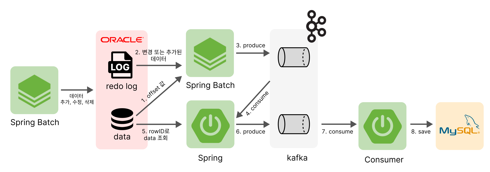

 

<!--  

 -->

 

## 팀원 소개

[//]: # (> **[한화시스템 BEYOND SW캠프 6기] Final Project**)

> **딥담화 DeepDamHwa** 
> 주간 기술 지식 리뷰를 베이스로 실제 기술들을 사용해보는 스터디 모임입니다. 
<table align="center">
 <tr>
    <td align="center"><a href="https://github.com/SihyunSeo"></td>
    <td align="center"><a href="https://github.com/kangkings"></td>
    <td align="center"><a href="https://github.com/706com"></td>
    <td align="center"><a href="https://github.com/jimnyy"></td>
    <td align="center"><a href="https://github.com/shinebyul"></td>
  </tr>
  <tr>
    <td align="center"><a href="https://github.com/SihyunSeo"><b>서시현</b></td>
    <td align="center"><a href="https://github.com/kangkings"><b>강태성</b></td>
    <td align="center"><a href="https://github.com/706com"><b>곽동현</b></td>
    <td align="center"><a href="https://github.com/jimnyy"><b>도지민</b></td>
    <td align="center"><a href="https://github.com/shinebyul"><b>한별</b></td>
  </tr>
  </table>
 

### 목차
- [기술 스택](#-기술-스택)
- [CDC 프로젝트 소개](#-CDC-Project-소개)
- [프로젝트 설계](#-프로젝트-설계)
- [시스템 개선 과정](#-시스템-개선-과정)
- [문제 해결 사례](#-문제-해결-사례)
    

## 🔗 기술 스택
#### &nbsp;　[ Backend ]
&nbsp;&nbsp;&nbsp;&nbsp; 

#### &nbsp;　[ DB ]
&nbsp;&nbsp;&nbsp;</a>

#### &nbsp;　[ SERVER ]
&nbsp;&nbsp;&nbsp;

[//]: # (#### &nbsp;　[ Communication ])

[//]: # (&nbsp;&nbsp;&nbsp;&nbsp;)

[//]: # ()

[//]: # ()

[//]: # ()

[//]: # ()

[//]: # (   )

[//]: # (## 📚 Enadu 사이트 바로가기)

[//]: # (### [Enadu website]&#40;https://enadu.o-r.kr&#41;</a>)
  
## ︎︎🔗 CDC Project 소개

[//]: # ()

### 프로젝트 배경
- 딥담화 주간 기술 리뷰 시간에 다뤘었던 Migration ~~~~~~
   

###  프로젝트 목표
실시간으로 삽입, 수정, 삭제가 발생하는 Oracle 데이터의 로그를 수집하여, MySQL에 적합한 데이터로 전처리 후 MySQL에 적용하는 CDC(Change Data Capture) 시스템을 구축.

- `change_log` : Oracle의 로그를 수집해 Kafka로 발행. Offset을 활용해 변동 데이터를 지속적으로 추적 및 처리. 
- `payload` : Kafka에 발행된 로그를 읽어 Oracle로부터 실제 데이터를 조회해 Kafka로 다시 발행 
- `consumer` : Kafka의 발행된 데이터를 가져와 MySql DB에 동기화
 

[//]: # (### 세부 기능)

[//]: # (- **`WIKI`** )

[//]: # (  유저들이 프로그래밍 언어별 정보, 최신 기술에 관한 지식을 자유롭게 공유하고, 이를 체계적으로 관리할 수 있는 서비스를 제공한다.)

[//]: # (- **`QnA`** )

[//]: # (  개발자들이 직면한 문제와 에러를 질문하고, 답변을 얻을 수 있는 서비스를 제공한다.)

[//]: # (- **`ErrorArchive`** )

[//]: # (  단순히 문제를 해결하는 것에 그치지 않고, 해결 과정을 블로그 형태로 정리하고, 공유한다.)

[//]: # (- **`채팅`** )

[//]: # (  게시글의 작성자에게 추가적인 질문사항이 있을 떄, 실시간 소통이 가능한 1:1채팅 서비스를 제공한다.)

[//]: # (- **`포인트 및 랭킹`** )

[//]: # (  서비스 사용을 유도하기 위해 특정 조건에 따라 포인트를 부여하고, 활동을 통해 본인의 등급 및 랭킹을 제공한다.    )

[//]: # (     )

## 🔗 프로젝트 설계

[//]: # (### [4. 요구사항 정의서]&#40;https://docs.google.com/spreadsheets/d/10twxxTMI7e_H_zHhxfUHqkkvaU0XMbR9/edit?usp=sharing&ouid=109538896843972820204&rtpof=true&sd=true&#41;</a>)
이미지 넣기
#### 시스템 프로세스
1. ChangeLog 서버가 Oracle에서 Offset 값을 읽어온다.

2. Oracle의 Redo_Log로부터 Offset 이후의 로그를 조회해 Kafka로 발행한다.(change_log_topic)
   - 이때, RS_ID를 이용해 Offset에 저장된 값의 Redo_Log version과 현재 활성화된 Redo_Log version을 비교한다.
   - 만약 version이 같다면 현재 활성화된 Redo_Log 파일을 LogMiner로 읽어온 후, Offset값 이후의 로그를 조회해 Kafka로 발행한다.
   - 만약 version이 다르다면 Offset에 저장된 값의 Redo_Log 파일을 시작으로 현재 활성화된 Redo_Log 파일까지 로그를 조회해 Kafka로 발행한다. 
   - 데이터 조회는 Redo_Log 파일로 부터 읽은 데이터의 XIDUSN값과, XIDSLT값을 활용해 작업이 활성화 되지 않은 트랜잭션 데이터만 조회를 진행한다.

3. Payload 서버가 Kafka에 발행된 로그의 ROW_ID값을 이용해 Oracle로부터 실제 데이터를 조회한다.
4. 조회한 데이터와 필요한 정보를 객체에 담아 Kafaka로 발행한다.(payload_topic)
5. Consumer 서버가 Kafka로부터 데이터를 가져와 MySql에 동기화한다.

## 🔗 시스템 개선 과정
#### 1. 초기 시스템
Spring Batch 서버에 Oracle과 MySql을 연결해, Oracle의 변경 사항을 읽어 MySql로 바로 동기화.

한계 : 
- Spring Batch가 조회, 처리, 저장을 모두 책임지기 때문에, 데이터량이 많아질 경우 Spring Batch에 병목 현상
발생 가능성 높음

 

#### 2. Kafka 도입
Kafka를 도입해 데이터를 조회하는 역할과 적재하는 역할을 분리.

개선 사항 : 
- 기존의 모든 데이터 처리 과정을 부담했던 Spring Batch 서버의 역할을 분리하므로써 부하 감소
- 데이터 조회와 데이터 적재 과정이 분리되어 유지보수와 장애대응이 용이해짐.

한계 :
- Spring Batch가 모든 데이터 처리(로그 읽기, 가공, Kafka 전송)를 단독으로 수행하기 때문에 서버에 부하가 집중됌

 

#### 3. 작업 부하 분산을 위한 시스템 구조 분리
 
- 데이터 조회, 데이터 처리, 데이터 적재로? 역할을 분리하므로써 서버의 부하 감소.
- 유지보수 및 장애 대응 용이
- 시스템 확장성 증가
 

## 🔗 문제 해결 사례
1. 트랜젝션 격리 수준을 고려한 로그 수집

2. Offset관리를 통한 로그 데이터 수집 시작 위치 확인